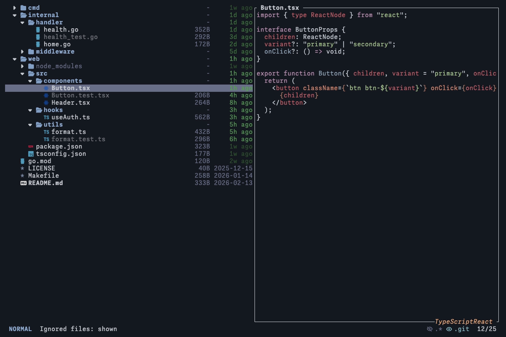

# trev

[](https://github.com/nabekou29/trev/actions/workflows/ci.yml)
[](LICENSE)
[](https://github.com/nabekou29/trev/releases)

Fast TUI file viewer with tree view, syntax-highlighted preview, and Neovim integration.

Built in Rust for speed and safety.



<details>
<summary>Demo</summary>


</details>

## Features

- **Tree view** — Browse directory structure with expand/collapse
- **Syntax-highlighted preview** — Built-in highlighting via syntect, no external tools needed
- **Image preview** — Sixel/Kitty protocol support for inline images
- **External command preview** — Pipe files through custom commands (e.g. `jq`, `glow`, `dust`)
- **Fuzzy search** — Filter files interactively with nucleo
- **File operations** — Copy, cut, paste, rename, delete, undo/redo
- **File system watcher** — Auto-refresh on external changes
- **Session persistence** — Restore tree state across restarts
- **Neovim integration** — Daemon mode with IPC via [trev.nvim](https://github.com/nabekou29/trev.nvim)
- **Configurable** — YAML config with keybinding customization, JSON Schema support

## Installation

### GitHub Releases

```sh
curl -LsSf https://github.com/nabekou29/trev/releases/latest/download/trev-installer.sh | sh
```

### Homebrew

```sh
brew install nabekou29/tap/trev
```

### Cargo

```sh
cargo install --git https://github.com/nabekou29/trev
```

### mise

```sh
mise use -g github:nabekou29/trev
# or
mise use -g cargo:trev@https://github.com/nabekou29/trev
```

### Requirements

- A terminal with [Nerd Fonts](https://www.nerdfonts.com/) for file icons
- Sixel or Kitty graphics protocol for image preview (optional)

## Quick Start

```sh
trev              # Open current directory
trev ~/projects   # Open specific directory
trev -a           # Show hidden files
trev --no-preview # Disable preview panel
```

### CLI Options

| Option                     | Description                                  |
| -------------------------- | -------------------------------------------- |
| `-a, --show-hidden`        | Show hidden files                            |
| `--show-ignored`           | Show gitignored files                        |
| `--no-preview`             | Disable preview panel                        |
| `--sort-order <ORDER>`     | smart, name, size, mtime, type, extension    |
| `--sort-direction <DIR>`   | asc, desc                                    |
| `--no-directories-first`   | Do not sort directories before files         |
| `--icons / --no-icons`     | File icons control                           |
| `--daemon`                 | Run as daemon (IPC server)                   |
| `--restore / --no-restore` | Session state restore control                |
| `--no-git`                 | Disable git integration                      |
| `--reveal <PATH>`          | Reveal a specific path on startup            |
| `--config <PATH>`          | Use a specific config file instead of default |
| `--config-override <PATH>` | Merge additional config (for editor plugins) |

### Subcommands

```sh
trev ctl reveal <PATH>    # Reveal file in a running daemon
trev ctl ping             # Check if daemon is alive
trev ctl quit             # Stop a running daemon
trev socket-path          # List running daemon sockets
trev schema               # Print config JSON Schema
trev completions <SHELL>  # Generate shell completions (bash, zsh, fish, etc.)
```

## Default Keybindings

| Key                 | Action                       |
| ------------------- | ---------------------------- |
| `j` / `k`           | Move down / up               |
| `l` / `h`           | Expand / Collapse            |
| `Enter`             | Change root (directory)      |
| `Backspace`         | Go to parent directory       |
| `g` / `G`           | Jump to first / last         |
| `Ctrl+d` / `Ctrl+u` | Half page down / up          |
| `/`                 | Fuzzy search                 |
| `J` / `K`           | Preview scroll down / up     |
| `Tab` / `Shift+Tab` | Cycle preview provider       |
| `P`                 | Toggle preview               |
| `Space`             | Toggle mark                  |
| `a` / `A`           | Create file / directory      |
| `r`                 | Rename                       |
| `y` / `x` / `p`     | Yank / Cut / Paste           |
| `d` / `D`           | Delete / Trash               |
| `u` / `Ctrl+r`      | Undo / Redo                  |
| `c`                 | Copy menu (path, name, etc.) |
| `.` / `I`           | Toggle hidden / ignored      |
| `S` / `s`           | Sort menu / Toggle direction |
| `e`                 | Open in editor               |
| `?`                 | Show help                    |
| `q`                 | Quit                         |

Full reference: [docs/keybindings.md](docs/keybindings.md)

## Configuration

Config file: `~/.config/trev/config.yml`

Add this line at the top for editor autocompletion:

```yaml
# yaml-language-server: $schema=https://raw.githubusercontent.com/nabekou29/trev/main/config.schema.json
```

Full reference: [docs/configuration.md](docs/configuration.md)

### Example

```yaml
sort:
  order: smart
  direction: asc
  directories_first: true

display:
  show_hidden: false
  show_preview: true
  show_icons: true
  columns:
    - git_status
    - size
    - modified_at

preview:
  max_lines: 1000
  commands:
    - name: "Pretty JSON"
      extensions: [json]
      priority: high
      command: jq
      args: ["."]
```

Full reference: [docs/configuration.md](docs/configuration.md)

## Neovim Integration

Use [trev.nvim](https://github.com/nabekou29/trev.nvim) for Neovim integration with side panel and floating picker modes.

```lua
-- lazy.nvim
{
  "nabekou29/trev.nvim",
  config = function()
    require("trev").setup({
      width = 30,
      auto_reveal = true,
      action = "edit",
    })
  end,
}
```

See [trev.nvim](https://github.com/nabekou29/trev.nvim) for full documentation.

## License

MIT
